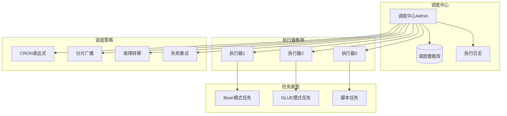

# ⏰ test-xxl-job - 分布式任务调度测试


## 📖 项目简介

test-xxl-job是XXL-JOB分布式任务调度平台的学习测试项目,演示任务调度、定时任务、分片任务、失败重试等核心功能。

## 🏗️ 系统架构



## 🚀 快速开始

```bash
# 克隆项目
git clone https://github.com/yourusername/test-xxl-job.git

# 初始化数据库
mysql -u root -p < db/tables_xxl_job.sql

# 启动调度中心
cd xxl-job-admin
mvn spring-boot:run

# 启动执行器
cd xxl-job-executor
mvn spring-boot:run

# 访问调度中心
# http://localhost:8080/xxl-job-admin
```

## 💡 核心示例

### Bean模式任务

```java
@Component
public class SampleXxlJob {
    
    @XxlJob("demoJobHandler")
    public void demoJobHandler() throws Exception {
        XxlJobHelper.log("XXL-JOB, Hello World.");
        
        // 业务逻辑
        for (int i = 0; i < 5; i++) {
            XxlJobHelper.log("beat at:" + i);
            TimeUnit.SECONDS.sleep(2);
        }
        
        // 默认返回成功
    }
}
```

### 分片广播任务

```java
@Component
public class ShardingXxlJob {
    
    @XxlJob("shardingJobHandler")
    public void shardingJobHandler() throws Exception {
        // 分片参数
        int shardIndex = XxlJobHelper.getShardIndex();
        int shardTotal = XxlJobHelper.getShardTotal();
        
        XxlJobHelper.log("分片参数: 当前分片序号={}, 总分片数={}", 
                        shardIndex, shardTotal);
        
        // 业务逻辑
        List<Integer> allData = getAllData();
        List<Integer> shardingData = allData.stream()
            .filter(i -> i % shardTotal == shardIndex)
            .collect(Collectors.toList());
        
        process(shardingData);
    }
}
```

### 任务参数传递

```java
@Component
public class ParamXxlJob {
    
    @XxlJob("paramJobHandler")
    public void paramJobHandler() throws Exception {
        // 获取任务参数
        String param = XxlJobHelper.getJobParam();
        
        XxlJobHelper.log("任务参数: {}", param);
        
        // 解析参数
        JSONObject json = JSON.parseObject(param);
        String type = json.getString("type");
        Integer count = json.getInteger("count");
        
        // 执行业务逻辑
        processByType(type, count);
    }
}
```

## 📊 执行器配置

```yaml
xxl:
  job:
    admin:
      addresses: http://localhost:8080/xxl-job-admin
    executor:
      appname: xxl-job-executor
      address:
      ip:
      port: 9999
      logpath: /data/applogs/xxl-job/jobhandler
      logretentiondays: 30
    accessToken: ***SECRET***
```

## 🎯 核心特性

- **可视化管理**: Web界面管理任务
- **弹性扩容**: 执行器动态注册
- **故障转移**: 执行器故障自动转移
- **失败重试**: 任务失败自动重试
- **分片广播**: 大数据分片处理
- **任务依赖**: 子任务触发

## 📝 更新日志

### v1.0.0 (2024-01-01)
- ✨ 初始版本发布
- ✨ 完成Bean模式任务
- ✨ 完成分片广播任务
- ✨ 完成失败重试测试

---

⭐ 如果这个项目对你有帮助,欢迎Star支持!
